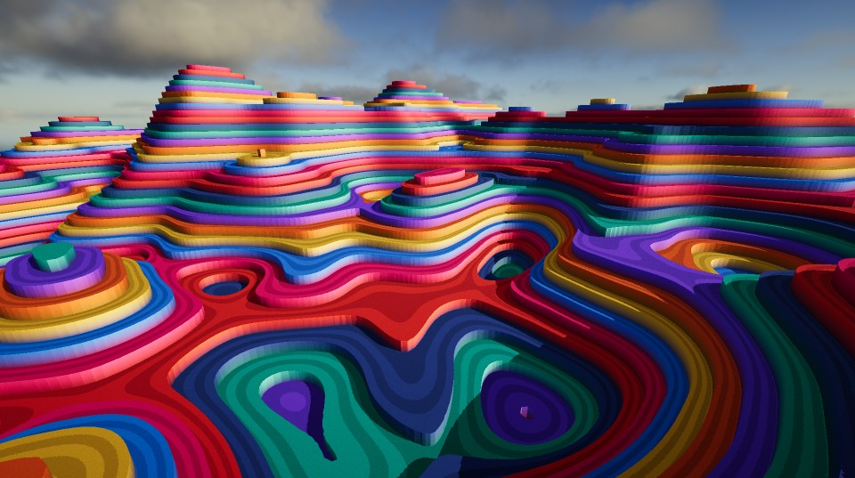

# TSL Isolines Geometry



Welcome to "TSL Isolines Geometry" 
This repo is adressed to three.js enthousiasts curious about TSL, but also to creative coders who may not know about this particular algorithm.

## Website 

Visit https://ulucode.com/random/webgputests/isolines/ to play!
Requires a browser with WebGPU support.

## TSL 
Most of the important code, regarding TSL and the implementation of the algorithm is in [/src/lib/elements/IsolinesMeshing.ts](https://github.com/ULuIQ12/webgpu-isoline-geometry/blob/main/src/lib/elements/IsolinesMeshing.ts)
The file is commented and uses descriptive variable names.
It is partially typed, but don't worry if you know nothing about Typescript : you can safely ignore it (although I would encourage you to look into it).

## Disclaimer
This is very experimental : I haven't looked under the hood at how TSL works, I'm just going from the examples provided by three.js and their documentation. 
I can't guarantee that I'm following good TSL practices is such a thing exists. My goal was to produce a fun toy, with an artistic flavor.

## Features

- **TSL and WebGPU**: Takes advantage of Three Shading Language (TSL) and WebGPU, with vertex, fragment and compute shaders all in Javascript, no WGSL involved for the end user.
- **Interactive Simulation**: Plenty of buttons and sliders to play with, as well cursor interactions.
- **Capture**: Capture still frames of your creation.


## Getting Started

To start the development environment for this project, follow these steps:

1. Clone the repository to your local machine:

  ```bash
  git clone https://github.com/ULuIQ12/webgpu-isoline-geometry.git
  ```

2. Navigate to the project directory:

  ```bash
  cd webgpu-isoline-geometry
  ```

3. Install the dependencies:

  ```bash
  npm install
  ```

4. Start the development server:

  ```bash
  npm run dev
  ```

  This will start the development server and open the project in your default browser.

## Building the Project

1. Edit the base path in vite.config.ts

2. To build the project for production, run the following command:

```bash
npm run build
```

This will create an optimized build of the project in the `dist` directory.


## Acknowledgements
- Uses Three.js https://threejs.org/
- Built with Vite https://vitejs.dev/
- UI Management uses LilGui and a bit of React https://react.dev/
- UI components use TailwindCSS https://tailwindcss.com/ 
- SDF functions and other utilities from Inigo Quilez https://iquilezles.org/
- Skybox is https://polyhaven.com/a/table_mountain_2_puresky by Greg Zaal and Jarod Guest

## Resources 
- Three.js WebGPU examples : https://threejs.org/examples/?q=webgpu
- Three.js TSL documentation : https://github.com/mrdoob/three.js/wiki/Three.js-Shading-Language


   